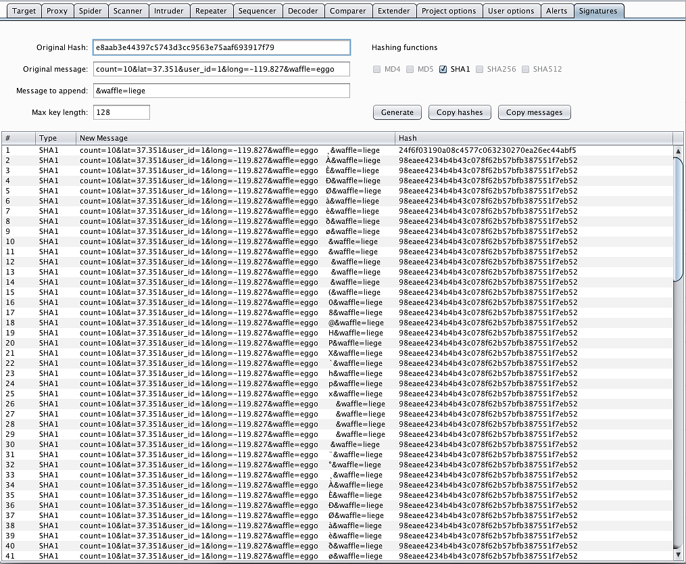
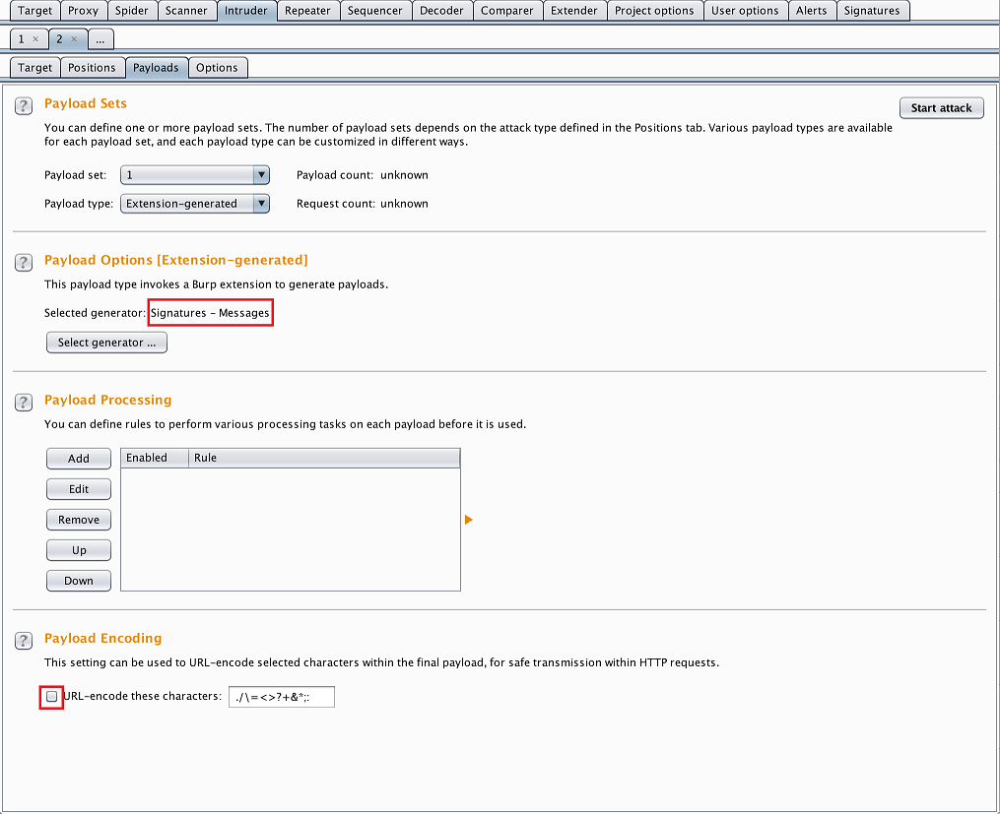
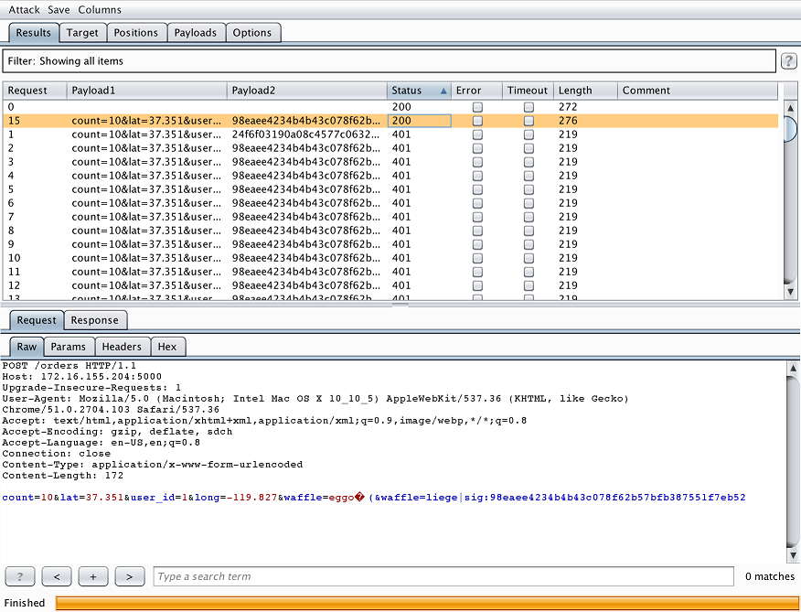
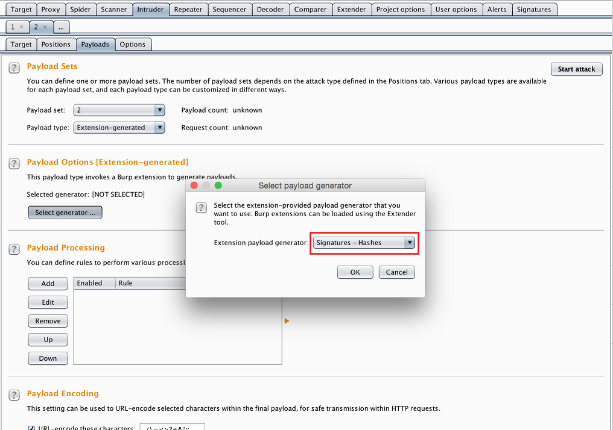

# Signatures v0.0.1 - Length extension attacks in Burp Suite

Burp Suite extension to perform hash length extension attacks on weak signature mechanisms.

## Use cases

* [Cryptopals](https://cryptopals.com/sets/4/challenges/29)
* [Stripe CTF](https://github.com/stripe-ctf/stripe-ctf-2.0/tree/master/levels/7)
* [My own vulnerable app](https://github.com/vergl4s/cheese-selection)

## Example

## TODO

* RIPEMD
* Whirlpool
* Tab for HMAC generation
* Fix copy message button when padding has line breaks